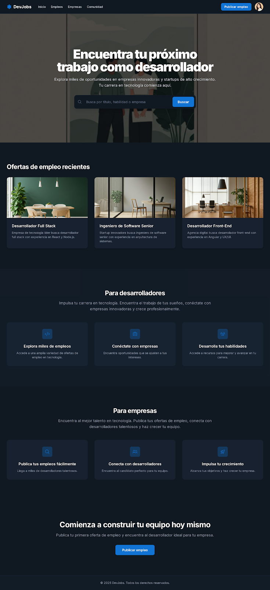
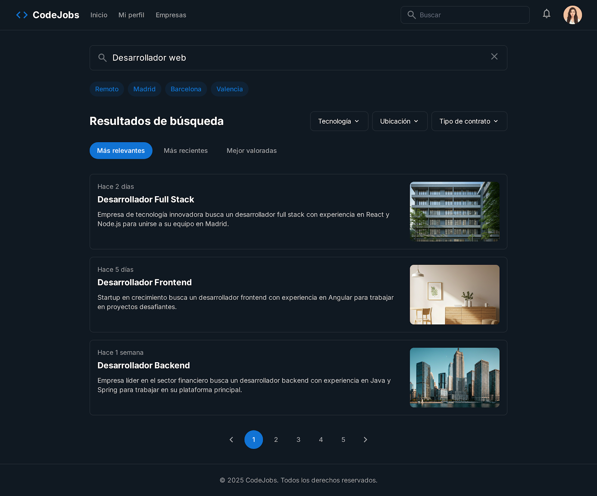
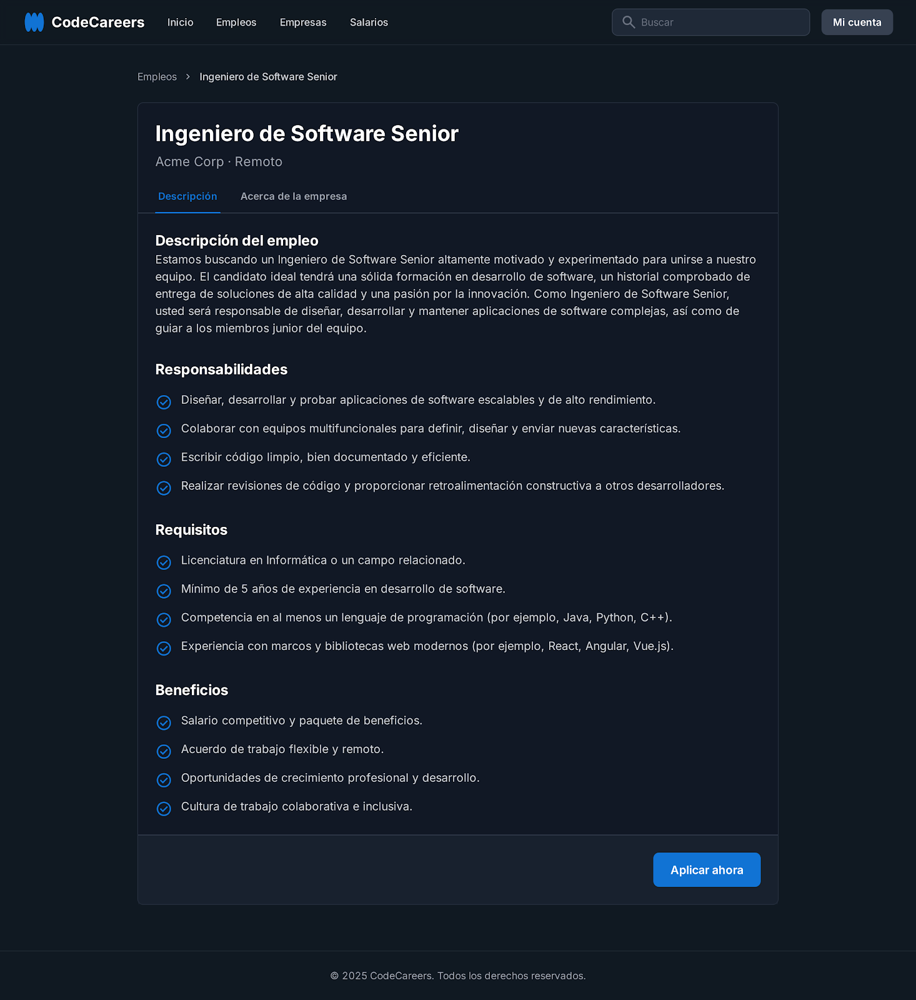
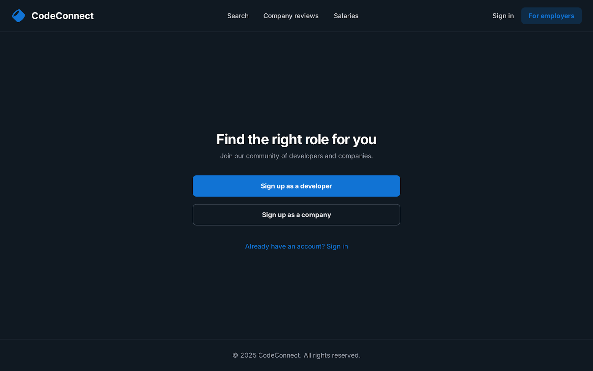
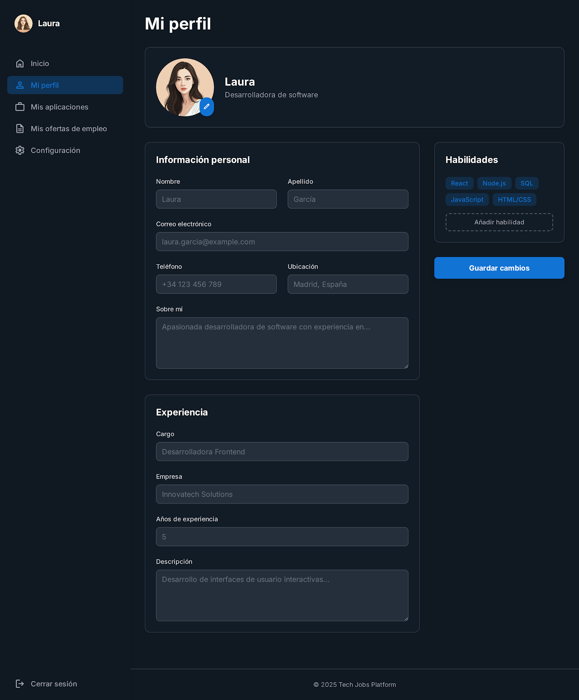

#  DevJobs :briefcase:

Plataforma web para la búsqueda de empleo orientada a desarrolladores y empresas.  
El objetivo es ofrecer una experiencia clara, simple y moderna para conectar talento con oportunidades.

##  Páginas principales :notebook_with_decorative_cover:

- **Inicio**: Página principal con barra de búsqueda, ofertas recientes y secciones destacadas para desarrolladores y empresas.  
- **Resultados de Búsqueda**: Lista de ofertas de empleo filtrables y ordenables según criterios del usuario.  
- **Detalles de la Oferta**: Información completa de cada puesto (requisitos, responsabilidades, beneficios) y opción para postularse.  
- **Registro / Inicio de Sesión**: Página unificada para que usuarios se registren como desarrolladores o empresas, o accedan a su cuenta existente.  
- **Perfil de Usuario o Empresa**: Espacio para que cada usuario gestione sus datos, vea aplicaciones enviadas o publique/edite ofertas de empleo.  

##  Tecnologías utilizadas :wrench:

<div align="center" background-color="white">
  
  
  
  
  
  

</div>

- **Frontend**: HTML, CSS, JavaScript, React  
- **Backend**: Node.js  
- **Base de Datos**: SQL
##  Instalación y ejecución (futuro) :rocket:

> :warning: En desarrollo: los pasos podrán variar a medida que avance el proyecto.

1. Clona el repositorio:

``` git clone https://github.com/usuario/devjobs.git```

2. Ingresa a la carpeta del proyecto: 

```cd devjobs```

3. Instala las dependencias:

```npm install```

4. Inicia el servidor de desarrollo:

```npm run dev```

##  Diseño inicial :camera:

<section style="display: flex; flex-direction: column; gap: 20px;">
    <figure>
      
      <figcaption>Ejemplo visualizacion: Pagina de Inicio/Home</figcaption>
    </figure>
    <figure>
      
      <figcaption>Ejemplo visualizacion: Pagina de Detalle del Empleo.</figcaption>
    </figure>
    <figure>
      
      <figcaption>Ejemplo visualizacion: Pagina Busqueda.</figcaption>
    </figure>
    <figure>
      
      <figcaption>Ejemplo de visualizacion: Registro/Inicio de sesion.</figcaption>
    </figure>
    <figure>
      
      <figcaption>Ejemplo de visualizacion: Pagina Perfil de usuario/Empresa .</figcaption>
    </figure>
</section>


##  Estado del proyecto :pushpin:

Actualmente en fase inicial: estructura básica del frontend y definición de las vistas principales.
Próximos pasos:

Implementar maquetación con HTML y CSS.

Configurar React y navegación entre páginas.

Diseñar API en Node.js para manejar ofertas de empleo.

Conectar base de datos SQL para usuarios y ofertas.

##  Contribuciones :handshake:

Las contribuciones son bienvenidas. Puedes:

Abrir un issue con sugerencias o reportes de errores.

Crear un pull request con nuevas funcionalidades o mejoras.

##  Licencia :spiral_notepad:

Este proyecto se distribuye bajo la licencia MIT.

